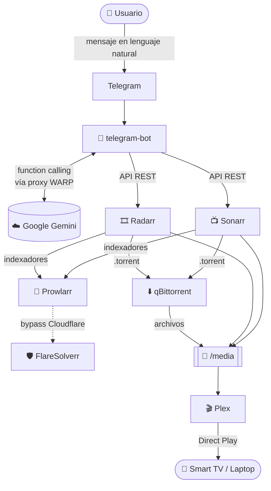

# 🎬 Home Media Server Automatizado

Servidor multimedia doméstico, autoalojado y controlado por un **bot de Telegram con IA**. Pedís una película o serie en lenguaje natural y el sistema la busca, la descarga, la organiza y la deja lista para reproducir en Plex, todo automáticamente.

> Ejemplo: le escribís *"quiero ver Oppenheimer"* al bot y, sin tocar nada más, unos minutos después la película aparece en tu Plex.

---

## 📑 Tabla de contenidos

- [🎬 Home Media Server Automatizado](#-home-media-server-automatizado)
  - [📑 Tabla de contenidos](#-tabla-de-contenidos)
  - [✨ Características](#-características)
  - [🏗️ Arquitectura](#️-arquitectura)
  - [🧩 Componentes](#-componentes)
  - [📋 Requisitos](#-requisitos)
  - [🚀 Instalación](#-instalación)
  - [⚙️ Configuración](#️-configuración)
  - [💬 Uso del bot](#-uso-del-bot)
  - [🔄 Cómo funciona (flujo interno)](#-cómo-funciona-flujo-interno)
  - [📁 Estructura del proyecto](#-estructura-del-proyecto)
  - [🔌 Puertos expuestos](#-puertos-expuestos)
  - [🛠️ Solución de problemas](#️-solución-de-problemas)
  - [🔐 Notas de privacidad y responsabilidad](#-notas-de-privacidad-y-responsabilidad)

---

## ✨ Características

- 🤖 **Control por lenguaje natural**: pedís contenido por chat, sin menús ni comandos complicados.
- 🧠 **IA con function calling**: Google Gemini interpreta el pedido y decide qué acción ejecutar (buscar, agregar, descargar).
- 🎞️ **Películas, series completas y episodios sueltos**: soporta los tres casos.
- 📥 **Descarga y organización automática**: Radarr/Sonarr filtran calidad, descargan vía qBittorrent y renombran/ordenan los archivos.
- 📺 **Streaming en la red local**: Plex sirve el contenido a Smart TVs, laptops y celulares.
- 🔒 **Tráfico del bot cifrado**: las llamadas a Gemini salen a través del proxy SOCKS5 de Cloudflare WARP.
- 🐳 **100% Dockerizado**: todo el stack se levanta con un solo `docker compose up`.

---

## 🏗️ Arquitectura

El sistema corre íntegramente en un servidor local (una laptop Lenovo i3 con 12 GB de RAM) dentro de contenedores Docker aislados. Los dispositivos personales solo consumen el contenido final vía Plex; nunca participan del proceso de descarga.



---

## 🧩 Componentes

| Servicio | Rol | Imagen |
|----------|-----|--------|
| **telegram-bot** | Interfaz conversacional con IA (Gemini) que orquesta todo el sistema. | build local (`Dockerfile`) |
| **Radarr** | Gestor automatizado de **películas**: busca, filtra por calidad, ordena a descargar y organiza. | `linuxserver/radarr` |
| **Sonarr** | Gestor automatizado de **series y episodios** (misma lógica que Radarr). | `linuxserver/sonarr` |
| **Prowlarr** | Gestor centralizado de indexadores; provee resultados a Radarr y Sonarr. | `linuxserver/prowlarr` |
| **qBittorrent** | Cliente de descargas P2P. | `linuxserver/qbittorrent` |
| **Plex** | Servidor de streaming para la red local (metadata, pósters, reproducción). | `linuxserver/plex` |
| **FlareSolverr** | Resuelve los desafíos anti-bot de Cloudflare para los indexadores. | `flaresolverr/flaresolverr` |
| **WARP** | Proxy SOCKS5 (Cloudflare WARP) usado por el bot para cifrar el tráfico hacia Gemini. | `caomingjun/warp` |

---

## 📋 Requisitos

- **Docker** y **Docker Compose** instalados en el servidor.
- Un **token de bot de Telegram** (se obtiene con [@BotFather](https://t.me/BotFather)).
- Una **API key de Google Gemini** (desde [Google AI Studio](https://aistudio.google.com/)).
- Las **API keys de Radarr y Sonarr** (se generan dentro de cada app: `Settings → General`).

---

## 🚀 Instalación

1. **Cloná el repositorio:**

   ```bash
   git clone <url-del-repo>
   cd bot
   ```

2. **Creá tu archivo de variables de entorno** a partir del ejemplo:

   ```bash
   cp .env.example .env
   ```

3. **Editá `.env`** y completá tus tokens y API keys (ver [Configuración](#-configuración)).

4. **Levantá el stack:**

   ```bash
   docker compose up -d
   ```

5. **Configuración inicial de las apps** (una sola vez):
   - Entrá a **Prowlarr** (`http://<servidor>:9696`) y agregá tus indexadores.
   - Conectá Prowlarr con **Radarr** y **Sonarr** (`Settings → Apps`).
   - En **Radarr** (`:7878`) y **Sonarr** (`:8989`) configurá la **carpeta raíz** y el **perfil de calidad**.
   - En cada app copiá la **API Key** (`Settings → General`) y pegala en tu `.env`.
   - Agregá qBittorrent como cliente de descarga en Radarr y Sonarr (`Settings → Download Clients`).

6. **Reiniciá el bot** para que tome las API keys nuevas:

   ```bash
   docker compose restart telegram-bot
   ```

---

## ⚙️ Configuración

Todas las variables viven en `.env`. Este es el detalle de cada una:

| Variable | Descripción | Por defecto |
|----------|-------------|-------------|
| `TELEGRAM_BOT_TOKEN` | Token del bot dado por BotFather. | — (obligatorio) |
| `GEMINI_API_KEY` | API key de Google AI Studio. | — (obligatorio) |
| `GEMINI_MODEL` | Modelo de Gemini a usar. | `gemini-2.5-flash` |
| `RADARR_URL` | URL interna de Radarr. | `http://radarr:7878` |
| `RADARR_API_KEY` | API key de Radarr. | — (obligatorio) |
| `SONARR_URL` | URL interna de Sonarr. | `http://sonarr:8989` |
| `SONARR_API_KEY` | API key de Sonarr. | — (obligatorio) |
| `WARP_PROXY` | Proxy SOCKS5 de WARP (solo afecta el tráfico a Gemini). | `socks5://warp:1080` |
| `HTTP_TIMEOUT` | Timeout en segundos para todas las llamadas HTTP. | `30` |

---

## 💬 Uso del bot

Abrí el chat con tu bot en Telegram y escribile en lenguaje natural. No hace falta aprender comandos.

| Comando | Acción |
|---------|--------|
| `/start` | Muestra el mensaje de bienvenida y ejemplos. |

**Ejemplos de mensajes:**

- 🎬 `Quiero ver Oppenheimer`
- 📺 `Descargá Breaking Bad`
- 🎯 `Bajame el S02E05 de Breaking Bad`
- 🔎 `Buscá la última de Nolan`

El bot te muestra los resultados encontrados, te pide que confirmes cuál querés y recién ahí lo manda a descargar. Todo se descarga en 1080p por defecto.

---

## 🔄 Cómo funciona (flujo interno)

1. **Solicitud**: mandás un mensaje al bot de Telegram.
2. **Interpretación (IA)**: el bot envía el mensaje a Gemini junto con el catálogo de *tools* disponibles. Gemini decide qué función ejecutar (`search_movie`, `add_series`, `download_episode`, etc.) y con qué argumentos.
3. **Ejecución controlada**: el bot ejecuta la función contra la API de Radarr o Sonarr. La IA **nunca** ejecuta nada por su cuenta; solo propone la llamada y el bot la valida y corre.
4. **Búsqueda y filtro**: Radarr/Sonarr consultan Prowlarr, filtran por calidad y eligen el mejor resultado.
5. **Descarga**: se envía el `.torrent` a qBittorrent.
6. **Organización**: al terminar, Radarr/Sonarr renombran y mueven el archivo a `/media`.
7. **Consumo**: Plex detecta el archivo nuevo, baja la metadata y lo habilita para reproducción en la red local.

> 🔐 **Sobre la privacidad del tráfico**: en la configuración actual, el proxy WARP se usa **únicamente para cifrar las llamadas del bot hacia Gemini**. El tráfico P2P de qBittorrent **no** pasa por WARP. Si querés enrutar también las descargas a través de una VPN, deberías conectar el contenedor de qBittorrent a un contenedor tipo Gluetun/WARP mediante `network_mode: "service:..."` (ver [notas](#-notas-de-privacidad-y-responsabilidad)).

---

## 📁 Estructura del proyecto

```
bot/
├── bot.py               # Lógica del bot de Telegram + integración con Gemini y las *arr
├── Dockerfile           # Imagen del bot (Python 3.12 slim)
├── docker-compose.yml   # Definición de todo el stack de servicios
├── requirements.txt     # Dependencias de Python
├── .env.example         # Plantilla de variables de entorno
└── README.md            # Esta documentación
```

> ⚠️ **Nota sobre el build del bot**: el `docker-compose.yml` define `build: ./telegram-bot`, pero el `Dockerfile` y `bot.py` están en la raíz del repositorio. Antes de levantar el stack, ajustá el `build` a `.` (la raíz) o mové el `Dockerfile`/`bot.py`/`requirements.txt` a una carpeta `telegram-bot/` para que las rutas coincidan.

---

## 🔌 Puertos expuestos

| Servicio | Puerto | URL local |
|----------|--------|-----------|
| qBittorrent | `8080` | `http://<servidor>:8080` |
| Prowlarr | `9696` | `http://<servidor>:9696` |
| Radarr | `7878` | `http://<servidor>:7878` |
| Sonarr | `8989` | `http://<servidor>:8989` |
| FlareSolverr | `8191` | `http://<servidor>:8191` |
| WARP (SOCKS5) | `1080` | `socks5://<servidor>:1080` |
| Plex | `32400` | `http://<servidor>:32400/web` (usa `network_mode: host`) |

---

## 🛠️ Solución de problemas

- **El bot no responde**: revisá los logs con `docker compose logs -f telegram-bot`. Verificá que `TELEGRAM_BOT_TOKEN` y `GEMINI_API_KEY` sean correctos.
- **"Radarr no tiene ninguna carpeta raíz configurada"**: entrá a Radarr/Sonarr y definí la carpeta raíz en `Settings → Media Management`.
- **No encuentra resultados**: confirmá que Prowlarr tenga indexadores activos y que estén sincronizados con Radarr/Sonarr.
- **Errores de red hacia Gemini**: verificá que el contenedor `warp` esté arriba (`docker compose ps`) y que `WARP_PROXY` apunte a `socks5://warp:1080`.
- **Indexadores bloqueados por Cloudflare**: asegurate de que `flaresolverr` esté corriendo y configurado como proxy en Prowlarr.

---

## 🔐 Notas de privacidad y responsabilidad

- Este proyecto es para **uso personal y educativo**. Sos responsable de cumplir las leyes de derechos de autor de tu país y de usar únicamente contenido que tengas derecho a descargar.
- Si vas a compartir este repositorio, **nunca subas tu archivo `.env`** con tokens y API keys reales. Mantené solo `.env.example`.
- El tráfico P2P por defecto **no** está anonimizado (ver [flujo interno](#-cómo-funciona-flujo-interno)). Configurá una VPN para las descargas si la privacidad de ese tráfico es importante para vos.
